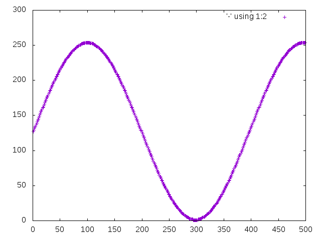

# Minimal Sound

Notes on making sounds in OpenBSD (and Linux).

## C Stuff

Build
```sh
# all
make
# square
make square
# saw
make saw
# static with musl
make static-musl
# clean
make clean
```

## Listen

### aucat/openBSD

```sh
cat /dev/random | aucat -e u8 -c 0:0 -i -
_build/square 800 | aucat -e u8 -c 0:0 -i -
# or
make test-openBSD-sine
make test-openBSD-triangle
```

### aplay/Linux

```sh
_build/square 800 | aplay -t raw -f u8 -c 1 -r 44100
# or
make test-linux-square
make test-linux-saw
```

## Visualising Wave Forms

```sh
# make a gnuplot of a cycle
bash/makeVisualiser.bash square
bash/makeVisualiser.bash saw
bash/makeVisualiser.bash triangle
bash/makeVisualiser.bash sine
# _build/sine.gif
```



## ASM

```sh
# build object file with debug symbols
cc -std=c99 -g -c square.c
# dissasemble
objdump -d -M intel square.o
```

## SNDIO Notes

_sndio_ is kernel rather that user-space, so can't be heled up by
other processes hogging processor cycles.

> Less is more  keep it simple!

Programming Interface via *sio_open* lib, *sndio.h*.
[Programming tips page.](http://www.sndio.org/tips.html)

Server Interface cia *sndoid*

```sh
# play white noise
cat > /dev/audio < /dev/random &
# stop
kill %1
# play amen from sream (comes out fast as can be prcessed?)
cat > /dev/audio < /home/rudenoise/Samples/amen.wav  &
# to stream output would it work to write a program that chops off 4-bytes/1-word and streams them at 44000khz?
# stop kill
kill %1
```

## Play a break
```sh
cd ~/
mkdir Samples
cd Samples
curl http://www.junglebreaks.co.uk/breaks/fools_gold.wav > fools_gold.wav
aucat -i fools_gold.wav
```

## Built in stuff

* [OpenBSD Audio](https://www.openbsd.org/faq/faq13.html)

```sh
# mixer controls
mixerclt
# record - ctrl-c to end
aucat -o recording.wav
# play recording
aucat -i recording.wav
# audio server
man sndiod
man  sndio
```

* [xoscope linux](http://xoscope.sourceforge.net/)
* [audread openBSD](http://ab1jx.1apps.com/ham/toys/audread/index.html)

## Links

* [sndio slides](http://www.openbsd.org/papers/asiabsdcon2010_sndio_slides.pdf)
* [Exploring Audio in OpenBSD](http://mrbool.com/exploring-audio-in-openbsd/29890)
* [Multimedia FAQ](http://openbsd.das.ufsc.br/faq/faq13.html)
